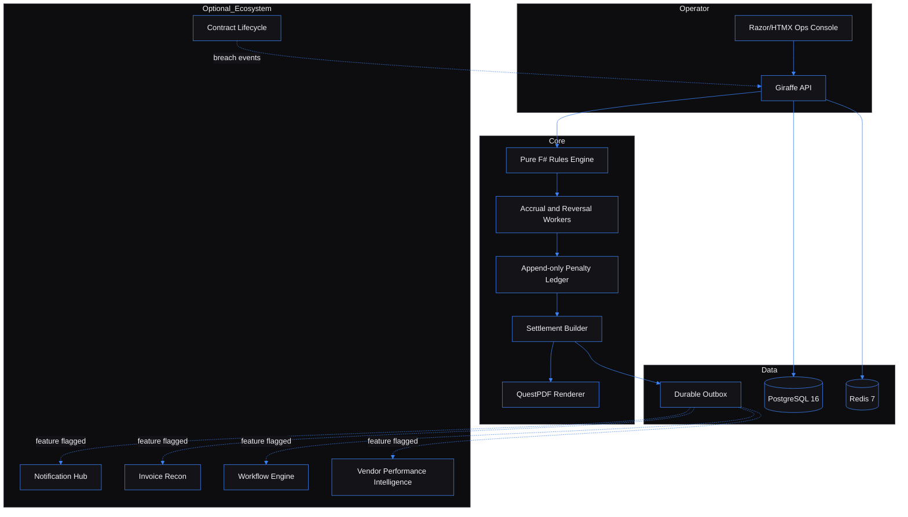

# SLA & Penalty Settlement Engine - turn SLA breaches into collectible credit notes

Built by [Kingsley Onoh](https://kingsleyonoh.com) - Systems Architect

## The Problem

Supplier contracts often promise SLA credits, but the money is lost between breach detection and accounts payable. This engine closes that gap: it turns missed obligations into deterministic penalties, append-only bilateral ledger entries, and settlement PDFs that can be collected. For a company spending $5M a year on SLA-heavy vendors, the PRD frames the recovery target at $60k-$150k/year.

## Architecture



## Key Decisions

- I chose a pure F# domain layer over database-side calculation because penalty rules need deterministic replay and snapshot tests.
- I chose an append-only ledger with compensating entries over mutable ledger rows because auditability matters more than easy correction.
- I chose server-rendered Razor/HTMX pages over a SPA because operators need a focused console, not a separate frontend application.
- I chose feature-flagged ecosystem clients over mandatory external services because the engine must work standalone with manual entry, CSV import, and local PDFs.
- I chose a durable outbox over direct side-effect calls because settlement posting and notifications need retry and idempotency boundaries.

## Setup

### Prerequisites

- .NET SDK 8
- Docker Desktop or Docker Engine with Compose
- PostgreSQL 16 and Redis 7 through `docker-compose.yml`
- PowerShell for the local acceptance script

### Installation

```powershell
git clone https://github.com/kingsleyonoh/sla-penalty-settlement-engine.git
cd sla-penalty-settlement-engine
dotnet restore Slapen.sln
Copy-Item .env.example .env.local
```

### Environment

`docker-compose.yml` reads `.env.local`. The local acceptance script also generates a temporary Compose override so the app container talks to `postgres:5432` and `redis:6379` inside Docker.

| Variable | Description |
|---|---|
| `ASPNETCORE_ENVIRONMENT` | ASP.NET Core environment name. |
| `PORT` | Application port, default `5109`. |
| `LOG_LEVEL` | Logging level. |
| `POSTGRES_DB` | Local database name. |
| `POSTGRES_USER` | Local database user. |
| `POSTGRES_PASSWORD` | Local database password. |
| `POSTGRES_TEST_DB` | Test database name. |
| `LOCAL_POSTGRES_PORT` | Host port mapped to PostgreSQL. |
| `LOCAL_REDIS_PORT` | Host port mapped to Redis. |
| `DATABASE_URL` | Runtime PostgreSQL connection string. |
| `TEST_DATABASE_URL` | Test PostgreSQL connection string. |
| `DATABASE_POOL` | Database pool size. |
| `AUTO_MIGRATE` | Runs migrations on app container boot when true. |
| `REDIS_URL` | Redis connection string. |
| `HANGFIRE_SCHEMA` | PostgreSQL schema for Hangfire tables. |
| `SESSION_SECRET` | Local session secret. |
| `SESSION_COOKIE_NAME` | UI cookie name. |
| `SESSION_MAX_AGE_SECONDS` | UI session lifetime. |
| `SELF_REGISTRATION_ENABLED` | Enables first-run/self-registration behavior. |
| `API_KEY_PREFIX` | API key prefix used for tenant keys. |
| `ALLOWED_ORIGINS` | CORS allow-list. |
| `PENALTY_ROUNDING_MODE` | Penalty rounding mode. |
| `SETTLEMENT_CADENCE` | Default settlement cadence. |
| `SETTLEMENT_DAY_OF_MONTH` | Default settlement build day. |
| `SETTLEMENT_MAX_RETRIES` | Max settlement posting retries. |
| `SETTLEMENT_RETRY_INITIAL_DELAY_SECONDS` | First settlement retry delay. |
| `MAX_OUTBOX_ATTEMPTS` | Max outbox processing attempts. |
| `OUTBOX_POLL_INTERVAL_SECONDS` | Outbox polling interval. |
| `ACCRUAL_WORKER_CONCURRENCY` | Accrual worker concurrency. |
| `NOTIFICATION_HUB_ENABLED` | Enables Notification Hub outbox delivery. |
| `NOTIFICATION_HUB_URL` | Notification Hub base URL. |
| `NOTIFICATION_HUB_API_KEY` | Notification Hub API key. |
| `WORKFLOW_ENGINE_ENABLED` | Enables Workflow Engine calls. |
| `WORKFLOW_ENGINE_URL` | Workflow Engine base URL. |
| `WORKFLOW_ENGINE_API_KEY` | Workflow Engine API key. |
| `CONTRACT_LIFECYCLE_ENABLED` | Enables Contract Lifecycle REST/NATS ingestion. |
| `CONTRACT_LIFECYCLE_URL` | Contract Lifecycle base URL. |
| `CONTRACT_LIFECYCLE_API_KEY` | Contract Lifecycle API key. |
| `CONTRACT_LIFECYCLE_BACKFILL_INTERVAL_SECONDS` | REST backfill interval. |
| `NATS_ENABLED` | Enables NATS consumer. |
| `NATS_URL` | NATS server URL. |
| `NATS_CREDS_PATH` | NATS credentials file path. |
| `NATS_STREAM_NAME` | NATS stream name. |
| `INVOICE_RECON_ENABLED` | Enables Invoice Recon posting. |
| `INVOICE_RECON_URL` | Invoice Recon base URL. |
| `INVOICE_RECON_API_KEY` | Invoice Recon API key. |
| `VPI_ENABLED` | Enables VPI signal emission. |
| `VPI_URL` | VPI base URL. |
| `VPI_API_KEY` | VPI API key. |
| `HUB_INGRESS_SECRET` | HMAC secret for `/api/breaches/from-hub`. |
| `SENTRY_DSN` | Sentry DSN. |
| `AXIOM_TOKEN` | Axiom token. |
| `AXIOM_DATASET` | Axiom dataset. |
| `POSTHOG_API_KEY` | PostHog API key. |
| `POSTHOG_HOST` | PostHog host. |
| `PROMETHEUS_ENABLED` | Enables `/metrics`. |
| `METRICS_BASIC_AUTH_USER` | Metrics basic-auth user. |
| `METRICS_BASIC_AUTH_PASS` | Metrics basic-auth password. |
| `AUTO_SEED` | Enables seed automation. |

### Run

```powershell
docker compose up -d postgres redis
dotnet run --project db/Migrate
dotnet watch --project src/Slapen.Api
```

For the closest local proof, run the containerized acceptance gate:

```powershell
.\scripts\run-local-acceptance.ps1
```

After it passes, the UI is available at `http://localhost:5109/login`. The script seeds a local acceptance API key:

```text
slapen_live_acceptance_local_00000000000000000000000000000000
```

## How It Works

```text
1. Operator defines counterparties, contracts, and SLA clauses.
2. A breach arrives from manual entry, CSV upload, Hub ingress, REST backfill, or NATS.
3. The F# rules engine calculates the penalty from the clause config.
4. The accrual worker writes a credit row and mirror row together.
5. Disputes and withdrawals write compensating rows instead of mutating history.
6. Settlement builder groups uncommitted accruals into a credit-note PDF.
7. Optional outbox workers post to ecosystem services when feature flags are enabled.
```

## Usage

### Fastest Local Path

```powershell
.\scripts\run-local-acceptance.ps1
```

That one command builds the app image, starts Postgres/Redis/app, runs migrations, seeds fixture data, creates a breach, accrues it, reverses it, checks four ledger rows, and verifies UI login.

### Core API Flow

Use the acceptance API key after running the script.

```powershell
$apiKey = "slapen_live_" + "acceptance_local_" + ("0" * 32)
$headers = @{ "X-API-Key" = $apiKey }
Invoke-RestMethod http://localhost:5109/api/tenants/me -Headers $headers
```

Expected response shape:

```json
{
  "id": "10000000-0000-0000-0000-000000000001",
  "name": "Acme GmbH DE",
  "slug": "acme-gmbh-de",
  "displayName": "Acme Procurement DE",
  "locale": "de-DE",
  "timezone": "Europe/Berlin",
  "defaultCurrency": "EUR"
}
```

Create a manual breach:

```powershell
$body = @{
  contractId = "12000000-0000-0000-0000-000000000001"
  slaClauseId = "13000000-0000-0000-0000-000000000001"
  sourceRef = "readme-demo-001"
  metricValue = 88.0
  unitsMissed = $null
  observedAt = "2026-05-03T09:00:00Z"
  reportedAt = "2026-05-03T10:00:00Z"
} | ConvertTo-Json

$created = Invoke-RestMethod http://localhost:5109/api/breaches/manual -Method Post -Headers $headers -ContentType "application/json" -Body $body
```

Accrue, reverse, and inspect the append-only ledger:

```powershell
$accrued = Invoke-RestMethod "http://localhost:5109/api/breaches/$($created.id)/accrue" -Method Post -Headers $headers
$reversed = Invoke-RestMethod "http://localhost:5109/api/breaches/$($created.id)/reverse" -Method Post -Headers $headers -ContentType "application/json" -Body (@{ reasonNotes = "operator withdrew breach" } | ConvertTo-Json)
$ledger = Invoke-RestMethod "http://localhost:5109/api/ledger/breaches/$($created.id)" -Headers $headers
$ledger.items.Count
```

After accrual and reversal, the count should be `4`: two accrual rows and two compensating reversal rows.

### Operator Console

The web UI supports the shipped local workflows:

1. Sign in with a tenant API key.
2. Create counterparties, contracts, and SLA clauses.
3. Create breaches manually or upload fixed-schema CSV files.
4. Accrue, reverse, dispute, and resolve breaches.
5. Inspect the ledger timeline.
6. Build settlements, approve them, post local PDFs, preview PDFs, and download credit notes.
7. Toggle ingestion adapters and run tenant-scoped pull/test actions.

### What It Handles

| Concern | Built behavior |
|---|---|
| Tenant isolation | API key resolves tenant; cross-tenant resources return 404. |
| Penalty calculation | Five PRD penalty shapes are modeled in the domain layer. |
| Ledger integrity | Ledger writes happen as bilateral pairs; database trigger blocks update/delete. |
| Corrections | Reversals and disputes create compensating entries. |
| Settlement artifacts | PDFs render from immutable settlement snapshots. |
| External systems | Contract Lifecycle, Hub, Invoice Recon, Workflow, and VPI clients are feature-flagged. |

### Existing HTTP Routes

| Method | Route | Purpose |
|---|---|---|
| `GET` | `/api/health` | Liveness. |
| `GET` | `/api/health/db` | Database check. |
| `GET` | `/api/health/ready` | DB, Redis, outbox, jobs, and adapter readiness. |
| `GET` | `/api/tenants/me` | Resolve current tenant from `X-API-Key`. |
| `GET` | `/api/contracts` | List tenant contracts. |
| `POST` | `/api/contracts` | Create manual contract. |
| `GET` | `/api/contracts/{id}` | Contract detail. |
| `GET` | `/api/contracts/{id}/clauses` | List SLA clauses. |
| `POST` | `/api/contracts/{id}/clauses` | Create SLA clause. |
| `POST` | `/api/breaches/manual` | Create manual breach. |
| `POST` | `/api/breaches/from-hub` | HMAC-verified Hub breach ingestion. |
| `POST` | `/api/breaches/{id}/accrue` | Accrue a breach. |
| `POST` | `/api/breaches/{id}/reverse` | Reverse a breach. |
| `GET` | `/api/ledger/breaches/{id}` | Ledger rows for a breach. |
| `GET` | `/api/counterparties` | List counterparties. |
| `POST` | `/api/counterparties` | Create counterparty. |
| `GET` | `/api/audit?limit=50` | Tenant audit events. |

## Tests

```powershell
dotnet test
.\scripts\run-local-acceptance.ps1
```

The full suite covers the domain rules engine, PostgreSQL repositories, append-only ledger behavior, TestHost API behavior, outbox retries, fake ecosystem clients, NATS Testcontainers boundaries, and Playwright UI flows. The local acceptance script is the highest-signal standalone proof because it drives the real Docker app against local Postgres and Redis.

## AI Integration

This project includes machine-readable context for AI tools:

| File | What it does |
|---|---|
| [`llms.txt`](llms.txt) | Project summary for LLMs ([llmstxt.org](https://llmstxt.org)). |
| [`openapi.yaml`](openapi.yaml) | OpenAPI 3.1 API specification. |
| [`mcp.json`](mcp.json) | MCP-style tool description for AI IDEs. |

### Cursor / Other AI IDEs

Point your AI agent at `llms.txt`, `openapi.yaml`, and `mcp.json` for public codebase context.

## Deployment

This project includes a production Compose file for self-hosting behind Traefik. The label targets `slapen.kingsleyonoh.com`, but that URL was not reachable during README generation, so this README does not present it as live.

### Production Stack

| Component | Role |
|---|---|
| `slapen` | Giraffe/ASP.NET Core app container from GHCR. |
| `traefik-public` | External reverse-proxy network. |
| `ecosystem` | External network for optional ecosystem service calls. |

### Self-Host

```powershell
docker pull ghcr.io/kingsleyonoh/sla-penalty-settlement-engine:latest
docker compose -f docker-compose.prod.yml up -d
```

Set the environment variables listed in **Setup > Environment** before starting.

<!-- THEATRE_LINK -->
